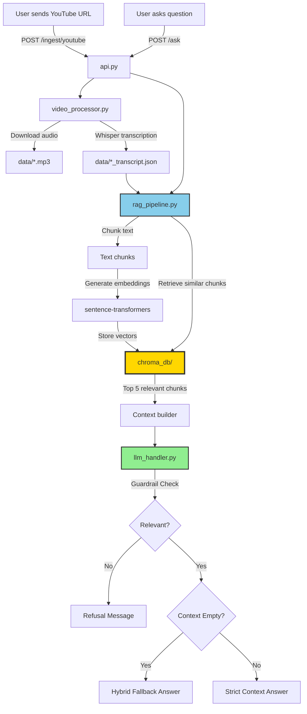
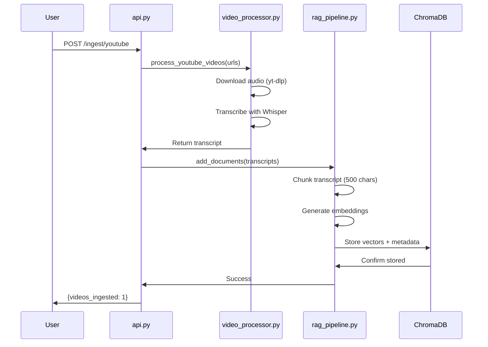

# Video RAG System 🎥🧠

A powerful Retrieval-Augmented Generation (RAG) system that allows you to chat with YouTube videos. It downloads audio, transcribes it using Whisper, indexes it in a local ChromaDB, and uses LLMs (Ollama/Groq) to answer your questions.

---

## 📁 Project Directory Structure

```
video-rag-system/
├── .env                        # Configuration (API keys, model settings)
├── requirements.txt            # Python dependencies
├── venv/                       # Virtual environment (local only)
│
├── src/                        # Source code
│   ├── api.py                 # FastAPI endpoints (entry point)
│   ├── config.py              # Configuration loader
│   ├── video_processor.py     # YouTube download + Whisper transcription
│   ├── rag_pipeline.py        # Chunking + Embeddings + ChromaDB
│   ├── llm_handler.py         # Ollama/Groq LLM integration
│
├── data/                       # Downloaded videos & transcripts
│   ├── *.mp3                  # Audio from YouTube
│   └── *_transcript.json      # Raw transcription from Whisper
│
└── chroma_db/                  # Vector database (persistent)
    ├── chroma.sqlite3         # SQLite database with embeddings
    └── [uuid]/                # Vector index files
```

---

## 🔄 Complete Data Flow



---

## 📂 Folder Responsibilities

### **1. `src/` - Application Code**

#### [api.py](src/api.py)
- **Purpose**: FastAPI web server (entry point)
- **Responsibilities**:
  - Expose `/ingest/youtube` endpoint
  - Expose `/ask` endpoint
  - Orchestrate components (no business logic)
- **Current endpoints**:
  - `GET /health` - Health check
  - `POST /ingest/youtube` - Ingest videos
  - `POST /ask` - Ask questions

#### [config.py](src/config.py)
- **Purpose**: Centralized configuration
- **Responsibilities**:
  - Load `.env` file
  - Validate settings
  - Provide environment-aware config (dev/prod)

#### [video_processor.py](src/video_processor.py)
- **Purpose**: Video ingestion
- **Responsibilities**:
  - Download YouTube audio with `yt-dlp`
  - Try to fetch YouTube captions (fast)
  - Fallback to Whisper transcription (accurate)
  - Save transcripts to `data/`

#### [rag_pipeline.py](src/rag_pipeline.py)
- **Purpose**: Core RAG logic (most important!)
- **Responsibilities**:
  - Chunk transcripts into ~500 char pieces
  - Generate embeddings using `sentence-transformers`
  - Store/retrieve from ChromaDB
  - Build context for LLM

#### [llm_handler.py](src/llm_handler.py)
- **Purpose**: LLM integration
- **Responsibilities**:
  - Call Ollama (development) or Groq (production)
  - Apply system prompts & guardrails
  - Handle domain checks (DSA/System Design)
  - Return generated answers

---

### **2. `data/` - Temporary Storage**

- **Purpose**: Store downloaded audio and raw transcripts
- **Files**:
  - `*.mp3` (YouTube audio)
  - `*_transcript.json` (Whisper output)

> [!NOTE]
> These files are automatically deleted after successful ingestion to save space.

---

### **3. `chroma_db/` - Vector Database** ⭐

> [!IMPORTANT]
> **This is where your embeddings live!**

- **Purpose**: Persistent vector storage
- **Contents**:
  - `chroma.sqlite3` - Database file with embeddings
  - `[uuid]/` - Vector index files
- **What's stored**:
  - Text chunks
  - Vector embeddings (384-dimensional)
  - Metadata (video_id, timestamps, chunk size)

---

## 🚀 What Happens Step-by-Step

### **Ingestion Flow (`/ingest/youtube`)**



### **Query Flow (`/ask`)**

```mermaid
sequenceDiagram
    participant U as User
    participant API as api.py
    participant RAG as rag_pipeline.py
    participant DB as ChromaDB
    participant LLM as llm_handler.py
    
    U->>API: POST /ask {question}
    API->>RAG: retrieve(query)
    RAG->>RAG: Embed question
    RAG->>DB: Search similar vectors
    DB->>RAG: Top 5 chunks
    RAG->>API: Retrieved docs
    API->>RAG: generate_context(docs)
    RAG->>API: Built context
    API->>LLM: answer_question(question, context)
    LLM->>LLM: Check Guardrails (CS Topic?)
    alt Irrelevant Topic
        LLM->>API: Refusal Message
    else Relevant Topic
        LLM->>LLM: Check Context
        alt Context Empty
            LLM->>LLM: Hybrid Fallback
        else Context Found
            LLM->>LLM: Strict RAG Generation
        end
        LLM->>API: Generated Answer
    end
    API->>U: {question, answer}


---

## ⚡ Usage

### Ingest a Video
```bash
curl -X POST http://localhost:8000/ingest/youtube \
  -H "Content-Type: application/json" \
  -d '{"urls": ["https://www.youtube.com/watch?v=dQw4w9WgXcQ"]}'
```

### Ask a Question
```bash
curl -X POST http://localhost:8000/ask \
  -H "Content-Type: application/json" \
  -d '{"question": "What is DP?"}'
```

---
**Author**: Championstein | **License**: MIT
